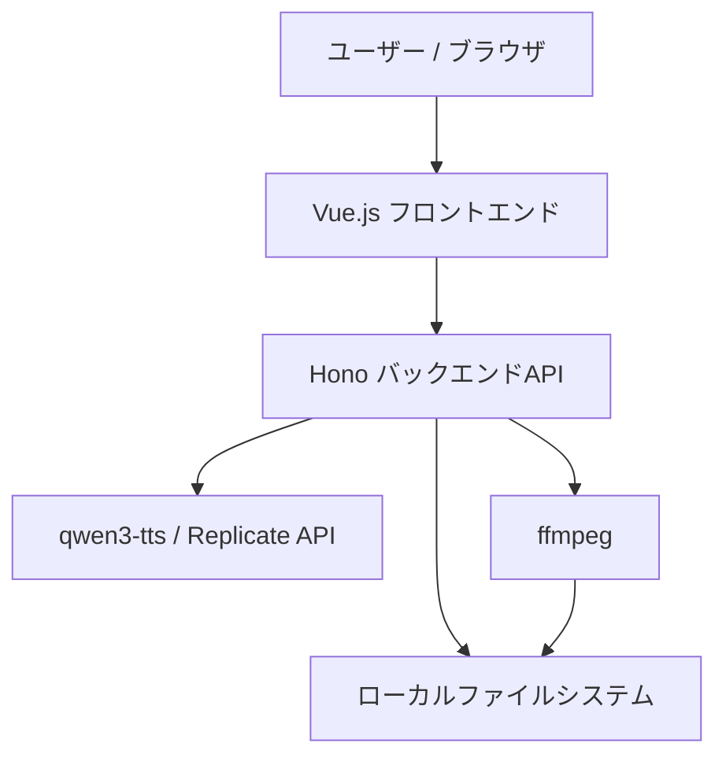
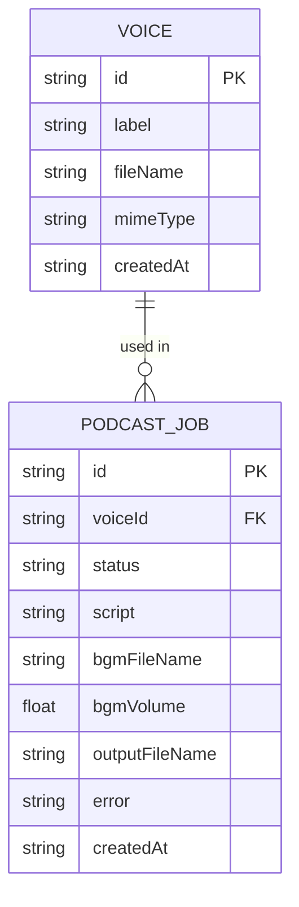
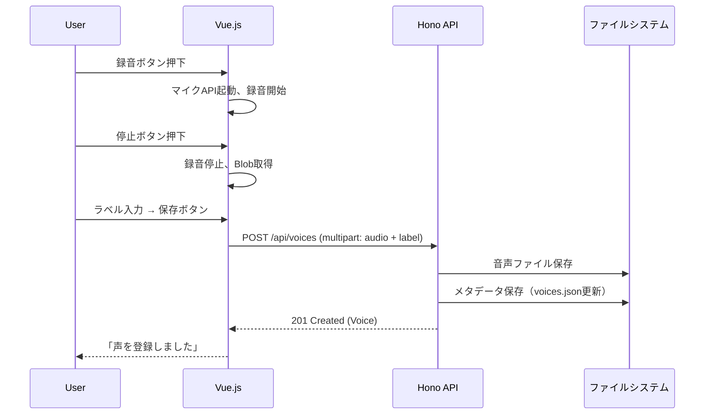
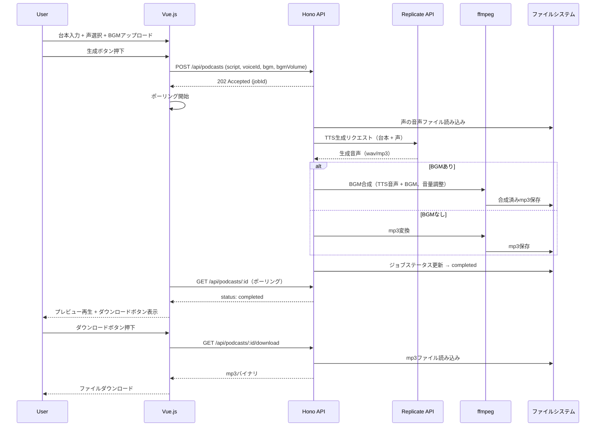
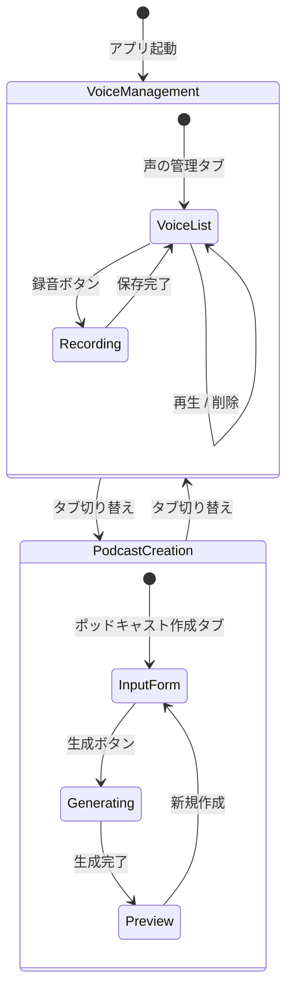

# 機能設計書 (Functional Design Document)

## システム構成図



## 技術スタック

| 分類 | 技術 | 選定理由 |
|------|------|----------|
| フロントエンド | Vue.js 3 (Composition API) | initial-requirementsで指定 |
| ビルドツール | Vite | Vue.js標準のビルドツール、高速なHMR |
| バックエンド | Hono (Node.js) | 軽量・高速なWebフレームワーク。APIキーの秘匿、ffmpeg実行のためサーバーが必要 |
| 言語 | TypeScript | 型安全性の確保 |
| TTS | qwen3-tts (Replicate API) | initial-requirementsで指定 |
| 音声合成 | ffmpeg | initial-requirementsで指定、BGM合成に利用 |
| テスト | Vitest + Playwright | 単体テスト + E2Eテスト |

## データモデル定義

### エンティティ: Voice（登録済みの声）

```typescript
interface Voice {
  id: string;            // UUID v4
  label: string;         // 声のラベル名（1-100文字）
  fileName: string;      // 保存先の音声ファイル名
  mimeType: string;      // 音声のMIMEタイプ（例: "audio/webm"）
  createdAt: string;     // ISO 8601 作成日時
}
```

**制約**:
- labelは1文字以上100文字以下
- fileNameはサーバー側で自動生成（UUID + 拡張子）
- 音声ファイルは `data/voices/` ディレクトリに保存

### エンティティ: PodcastJob（ポッドキャスト生成ジョブ）

```typescript
interface PodcastJob {
  id: string;              // UUID v4
  status: JobStatus;       // 生成ジョブの状態
  script: string;          // 台本テキスト
  voiceId: string;         // 使用する声のID
  bgmFileName?: string;    // BGMファイル名（任意）
  bgmVolume: number;       // BGM音量（0.0-1.0、デフォルト0.3）
  outputFileName?: string; // 生成されたmp3ファイル名
  error?: string;          // エラーメッセージ（失敗時）
  createdAt: string;       // ISO 8601 作成日時
}

type JobStatus = 'pending' | 'tts_processing' | 'mixing' | 'completed' | 'failed';
```

**制約**:
- scriptは1文字以上
- bgmVolumeは0.0以上1.0以下
- outputFileNameはジョブ完了後に設定される
- 生成ファイルは `data/output/` ディレクトリに保存

### ER図



## コンポーネント設計

### フロントエンド（Vue.js）

#### VoiceManager コンポーネント

**責務**:
- マイクからの音声録音
- 声の一覧表示・試聴・削除

**インターフェース**:
```typescript
// composable
function useVoiceRecorder() {
  startRecording(): Promise<void>;
  stopRecording(): Promise<Blob>;
  isRecording: Ref<boolean>;
}

function useVoiceList() {
  voices: Ref<Voice[]>;
  fetchVoices(): Promise<void>;
  deleteVoice(id: string): Promise<void>;
  playVoice(id: string): void;
}
```

#### PodcastCreator コンポーネント

**責務**:
- 台本入力フォーム
- 声の選択
- BGMアップロード・音量調整
- 生成実行・進捗表示・ダウンロード

**インターフェース**:
```typescript
function usePodcastCreator() {
  script: Ref<string>;
  selectedVoiceId: Ref<string>;
  bgmFile: Ref<File | null>;
  bgmVolume: Ref<number>;
  jobStatus: Ref<JobStatus | null>;
  outputUrl: Ref<string | null>;
  createPodcast(): Promise<void>;
}
```

### バックエンド（Hono）

#### VoiceController

**責務**:
- 声の登録・一覧・取得・削除のAPIエンドポイント

```typescript
class VoiceController {
  listVoices(c: Context): Promise<Response>;       // GET /api/voices
  getVoiceFile(c: Context): Promise<Response>;     // GET /api/voices/:id/file
  createVoice(c: Context): Promise<Response>;      // POST /api/voices
  deleteVoice(c: Context): Promise<Response>;      // DELETE /api/voices/:id
}
```

#### PodcastController

**責務**:
- ポッドキャスト生成ジョブの管理

```typescript
class PodcastController {
  createPodcast(c: Context): Promise<Response>;    // POST /api/podcasts
  getJobStatus(c: Context): Promise<Response>;     // GET /api/podcasts/:id
  downloadPodcast(c: Context): Promise<Response>;  // GET /api/podcasts/:id/download
}
```

#### TTSService

**責務**:
- Replicate APIとの通信
- qwen3-ttsによるTTS音声生成

```typescript
class TTSService {
  generateSpeech(script: string, voiceFilePath: string): Promise<Buffer>;
}
```

**依存関係**:
- Replicate Node.js SDK

#### AudioMixer

**責務**:
- ffmpegを使用したBGM合成
- mp3出力

```typescript
class AudioMixer {
  mixWithBgm(speechPath: string, bgmPath: string, volume: number, outputPath: string): Promise<void>;
  convertToMp3(inputPath: string, outputPath: string): Promise<void>;
}
```

**依存関係**:
- ffmpeg（システムにインストール済みであること）

#### VoiceRepository

**責務**:
- 声のメタデータと音声ファイルの永続化

```typescript
class VoiceRepository {
  findAll(): Promise<Voice[]>;
  findById(id: string): Promise<Voice | null>;
  save(voice: Voice, audioBuffer: Buffer): Promise<void>;
  delete(id: string): Promise<void>;
}
```

## ユースケース図

### 声の登録



### ポッドキャスト生成



## 画面遷移図



## API設計

### GET /api/voices

声の一覧を取得する。

**レスポンス**:
```json
{
  "voices": [
    {
      "id": "550e8400-e29b-41d4-a716-446655440000",
      "label": "通常の声",
      "mimeType": "audio/webm",
      "createdAt": "2025-01-15T10:00:00.000Z"
    }
  ]
}
```

### POST /api/voices

声を登録する。

**リクエスト**: `multipart/form-data`
- `audio`: 音声ファイル（Blob）
- `label`: 声のラベル（文字列）

**レスポンス**: `201 Created`
```json
{
  "id": "550e8400-e29b-41d4-a716-446655440000",
  "label": "通常の声",
  "mimeType": "audio/webm",
  "createdAt": "2025-01-15T10:00:00.000Z"
}
```

**エラーレスポンス**:
- 400 Bad Request: labelが空、または音声ファイルが未添付

### GET /api/voices/:id/file

声の音声ファイルを取得する（試聴用）。

**レスポンス**: 音声バイナリ（Content-Type: audio/webm等）

**エラーレスポンス**:
- 404 Not Found: 指定IDの声が存在しない

### DELETE /api/voices/:id

声を削除する。

**レスポンス**: `204 No Content`

**エラーレスポンス**:
- 404 Not Found: 指定IDの声が存在しない

### POST /api/podcasts

ポッドキャスト生成ジョブを作成する。

**リクエスト**: `multipart/form-data`
- `script`: 台本テキスト（文字列）
- `voiceId`: 使用する声のID（文字列）
- `bgm`: BGMファイル（任意）
- `bgmVolume`: BGM音量 0.0-1.0（任意、デフォルト0.3）

**レスポンス**: `202 Accepted`
```json
{
  "id": "job-uuid",
  "status": "pending"
}
```

**エラーレスポンス**:
- 400 Bad Request: scriptが空、voiceIdが未指定
- 404 Not Found: 指定voiceIdの声が存在しない

### GET /api/podcasts/:id

ジョブのステータスを取得する。

**レスポンス**:
```json
{
  "id": "job-uuid",
  "status": "completed",
  "createdAt": "2025-01-15T10:05:00.000Z"
}
```

statusの値: `pending` | `tts_processing` | `mixing` | `completed` | `failed`

failedの場合は `error` フィールドにメッセージを含む。

### GET /api/podcasts/:id/download

生成済みポッドキャストのmp3をダウンロードする。

**レスポンス**: mp3バイナリ（Content-Type: audio/mpeg）

**エラーレスポンス**:
- 404 Not Found: ジョブが存在しない
- 409 Conflict: ジョブが未完了

## ファイル構造

**データ保存形式**:
```
data/
├── voices/
│   ├── voices.json           # 声のメタデータ一覧
│   └── {uuid}.webm           # 録音された音声ファイル
├── bgm/
│   └── {uuid}.mp3            # アップロードされたBGMファイル
├── temp/
│   └── {job-uuid}-tts.wav    # TTS生成の一時ファイル
└── output/
    └── {job-uuid}.mp3        # 完成したポッドキャスト
```

**voices.json の例**:
```json
{
  "voices": [
    {
      "id": "550e8400-e29b-41d4-a716-446655440000",
      "label": "通常の声",
      "fileName": "550e8400-e29b-41d4-a716-446655440000.webm",
      "mimeType": "audio/webm",
      "createdAt": "2025-01-15T10:00:00.000Z"
    }
  ]
}
```

## セキュリティ考慮事項

- **APIキーの秘匿**: Replicate APIキーはバックエンドの環境変数（`.env`）で管理し、フロントエンドに露出させない
- **ファイルアップロードの制限**: 音声ファイルサイズの上限を設定（声: 50MB、BGM: 100MB）
- **パストラバーサル防止**: ファイル名にUUIDを使用し、ユーザー入力をファイルパスに直接使用しない

## エラーハンドリング

### エラーの分類

| エラー種別 | 処理 | ユーザーへの表示 |
|-----------|------|-----------------|
| マイクアクセス拒否 | 録音機能を無効化 | 「マイクへのアクセスを許可してください」 |
| 音声ファイル保存失敗 | 処理中断 | 「声の保存に失敗しました。再度お試しください」 |
| Replicate API エラー | ジョブをfailed状態に | 「音声生成に失敗しました: [APIエラー詳細]」 |
| Replicate API タイムアウト | ジョブをfailed状態に | 「音声生成がタイムアウトしました。再度お試しください」 |
| ffmpeg実行エラー | ジョブをfailed状態に | 「BGM合成に失敗しました」 |
| ファイルサイズ超過 | アップロード拒否 | 「ファイルサイズが上限を超えています（上限: XXM）」 |
| 声が未登録 | 生成ボタン無効化 | 「先に声を登録してください」 |

## テスト戦略

### ユニットテスト（Vitest）
- VoiceRepository: CRUD操作の正常系・異常系
- TTSService: APIリクエスト構築、レスポンスパース（Replicate APIをモック）
- AudioMixer: ffmpegコマンド構築の正確性（ffmpegをモック）
- 入力バリデーション: label長、script空チェック、bgmVolume範囲

### E2Eテスト（Playwright）
- 声の登録フロー: 録音 → ラベル入力 → 保存 → 一覧に表示
- 声の削除フロー: 一覧から削除 → 確認ダイアログ → 一覧から消える
- ポッドキャスト生成フロー: 台本入力 → 声選択 → 生成 → ダウンロード（TTS APIはモック）

### パフォーマンス最適化
- TTS生成は非同期ジョブとして処理し、フロントエンドはポーリングで進捗確認
- 一時ファイルはジョブ完了後に自動クリーンアップ
