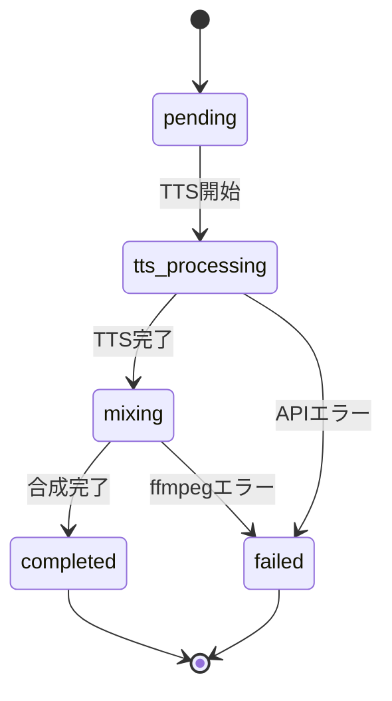

# プロジェクト用語集 (Glossary)

## 概要

このドキュメントは、AI Clone Podcaster プロジェクト内で使用される用語の定義を管理します。

**更新日**: 2026-01-29

## ドメイン用語

### 声（Voice）

**定義**: TTSのクローン元として登録された音声データとそのメタデータ

**説明**: ユーザーがブラウザのマイクAPIを通じて録音し、サーバーに保存した音声。TTS生成時にクローン元の声として使用される。

**関連用語**: 声の登録、TTS

**使用例**:
- 「声を登録する」 — マイクで録音した音声をラベル付きで保存する操作
- 「声を選択する」 — ポッドキャスト生成時にクローン元の声を一覧から選ぶ操作

**英語表記**: Voice

### 台本（Script）

**定義**: ポッドキャストの内容となるテキスト

**説明**: ユーザーがテキストエリアに入力する、ポッドキャストとして読み上げられる原稿。TTS APIに送信され音声に変換される。

**関連用語**: TTS、ポッドキャスト生成

**使用例**:
- 「台本を入力する」 — ポッドキャスト作成画面でテキストを入力する操作

**英語表記**: Script

### BGM合成

**定義**: TTS生成音声にBGM（バックグラウンドミュージック）を重ねて1つの音声ファイルにする処理

**説明**: ffmpegを使用してTTS音声とBGMファイルをミキシングする。BGMの音量はユーザーが調整可能で、TTS音声が聞き取りやすいバランスに設定される。

**関連用語**: AudioMixer、ffmpeg

**使用例**:
- 「BGMを合成する」 — TTS音声にBGMを重ねてmp3を出力する操作

**英語表記**: BGM Mixing

### ポッドキャスト生成

**定義**: 台本テキストと声からTTS音声を生成し、BGM合成を経て最終的なmp3ファイルを出力する一連の処理

**説明**: 非同期ジョブとして実行される。ステータスは pending → tts_processing → mixing → completed の順に遷移する。

**関連用語**: 台本、声、BGM合成、ジョブ

**使用例**:
- 「ポッドキャストを生成する」 — 生成ボタンを押してmp3の作成を開始する操作

**英語表記**: Podcast Generation

### ジョブ（PodcastJob）

**定義**: ポッドキャスト生成処理の実行単位

**説明**: 生成リクエストごとに1つのジョブが作成され、状態管理される。フロントエンドはポーリングでジョブの進捗を確認する。

**関連用語**: ポッドキャスト生成、JobStatus

**英語表記**: Job / Podcast Job

## 技術用語

### qwen3-tts

**定義**: Qwenが開発したテキスト音声合成（TTS）モデル

**公式サイト**: https://replicate.com/qwen/qwen3-tts

**本プロジェクトでの用途**: 台本テキストとクローン元の声からTTS音声を生成する

**関連ドキュメント**: docs/functional-design.md（TTSService）

### Replicate API

**定義**: 機械学習モデルをAPI経由で実行できるクラウドプラットフォーム

**公式サイト**: https://replicate.com/

**本プロジェクトでの用途**: qwen3-tts モデルの実行基盤。バックエンドサーバーからAPIキーを使用して呼び出す

**関連ドキュメント**: docs/architecture.md（セキュリティアーキテクチャ）

### ffmpeg

**定義**: マルチメディアファイルの変換・編集を行うコマンドラインツール

**公式サイト**: https://ffmpeg.org/

**本プロジェクトでの用途**: TTS音声とBGMの合成、mp3形式への変換

**バージョン**: システムインストール（最新版推奨）

**関連ドキュメント**: docs/functional-design.md（AudioMixer）

### Hono

**定義**: 軽量・高速なTypeScriptファーストのWebフレームワーク

**公式サイト**: https://hono.dev/

**本プロジェクトでの用途**: バックエンドAPIサーバー。RESTful APIエンドポイントの提供、ファイルアップロード処理、エラーハンドリング

**バージョン**: 4.x

**関連ドキュメント**: docs/architecture.md

### Vue.js

**定義**: プログレッシブJavaScriptフレームワーク

**公式サイト**: https://vuejs.org/

**本プロジェクトでの用途**: フロントエンドSPA。Composition APIを使用し、声の管理UIとポッドキャスト作成UIを構築

**バージョン**: 3.x (Composition API)

### Vite

**定義**: 高速なフロントエンドビルドツール

**公式サイト**: https://vite.dev/

**本プロジェクトでの用途**: Vue.jsアプリのビルド、開発サーバー（HMR）

**バージョン**: 6.x

### Vitest

**定義**: Viteベースの高速テストフレームワーク

**公式サイト**: https://vitest.dev/

**本プロジェクトでの用途**: ユニットテスト。サービス層・リポジトリ層のテスト実行

**バージョン**: 3.x

### Playwright

**定義**: クロスブラウザE2Eテストフレームワーク

**公式サイト**: https://playwright.dev/

**本プロジェクトでの用途**: E2Eテスト。声の管理フロー、ポッドキャスト生成フローのシナリオテスト

**バージョン**: 1.x

## 略語・頭字語

### TTS

**正式名称**: Text-to-Speech

**意味**: テキストを音声に変換する技術

**本プロジェクトでの使用**: qwen3-tts を使用して台本テキストからクローン声の音声を生成する

### BGM

**正式名称**: Background Music

**意味**: バックグラウンドミュージック

**本プロジェクトでの使用**: ポッドキャスト音声に重ねる背景音楽。ユーザーがmp3等のファイルをアップロードする

### API

**正式名称**: Application Programming Interface

**意味**: ソフトウェア間の通信インターフェース

**本プロジェクトでの使用**: バックエンドのREST API（Hono）、Replicate API（外部TTS）

### SPA

**正式名称**: Single Page Application

**意味**: 単一のHTMLページで動作するWebアプリケーション

**本プロジェクトでの使用**: Vue.jsで構築されたフロントエンド

### MVP

**正式名称**: Minimum Viable Product

**意味**: 最小限の機能で実用可能なプロダクト

**本プロジェクトでの使用**: PRDでP0（必須）に分類された機能群

## アーキテクチャ用語

### レイヤードアーキテクチャ

**定義**: ソフトウェアを責務ごとの層に分離する設計パターン

**本プロジェクトでの適用**: フロントエンド → コントローラー層 → サービス層 → データ層の4層構成

**関連コンポーネント**: VoiceController, TTSService, AudioMixer, VoiceRepository

**図解**:
```
フロントエンド（Vue.js）
    ↓ HTTP
コントローラー層（Hono routes）
    ↓
サービス層（TTSService, AudioMixer）
    ↓
データ層（VoiceRepository, ファイルシステム）
```

### Composable

**定義**: Vue.js Composition APIにおける再利用可能なステートフルロジックの単位

**本プロジェクトでの適用**: `useVoiceRecorder`, `useVoiceList`, `usePodcastCreator` など、UI操作のロジックを分離して管理

## ステータス・状態

### JobStatus（ジョブステータス）

| ステータス | 意味 | 遷移条件 | 次の状態 |
|----------|------|---------|---------|
| `pending` | 生成リクエスト受付済み | ジョブ作成時 | `tts_processing` |
| `tts_processing` | TTS音声を生成中 | Replicate API呼び出し開始 | `mixing` / `failed` |
| `mixing` | BGM合成中 | TTS生成完了後 | `completed` / `failed` |
| `completed` | 生成完了、ダウンロード可能 | BGM合成完了（またはBGMなしの場合mp3変換完了） | - |
| `failed` | 生成失敗 | エラー発生時 | - |

**状態遷移図**:


## データモデル用語

### Voice エンティティ

**定義**: 登録された声のメタデータ

**主要フィールド**:
- `id`: UUID v4、一意識別子
- `label`: 声のラベル名（1-100文字）
- `fileName`: サーバー上の音声ファイル名（UUID + 拡張子）
- `mimeType`: 音声のMIMEタイプ（例: `audio/webm`）
- `createdAt`: 登録日時（ISO 8601）

**制約**: labelは1文字以上100文字以下

### PodcastJob エンティティ

**定義**: ポッドキャスト生成ジョブの状態と構成情報

**主要フィールド**:
- `id`: UUID v4、一意識別子
- `status`: ジョブの状態（JobStatus型）
- `script`: 台本テキスト
- `voiceId`: 使用する声のID（Voice.id への参照）
- `bgmVolume`: BGM音量（0.0-1.0、デフォルト0.3）
- `outputFileName`: 生成されたmp3ファイル名

**関連エンティティ**: Voice（voiceId で参照）

## エラー・例外

### ValidationError

**クラス名**: `ValidationError`

**発生条件**: 入力値がバリデーションルールに違反した場合（ラベル空、台本空、BGM音量範囲外、ファイルサイズ超過など）

**対処方法**: エラーメッセージに従って入力値を修正する

**例**:
```typescript
throw new ValidationError('ラベルは1-100文字で入力してください', 'label', value);
```

### NotFoundError

**クラス名**: `NotFoundError`

**発生条件**: 指定されたIDのリソース（声、ジョブ）が存在しない場合

**対処方法**: 正しいIDを指定する。削除済みのリソースを参照していないか確認する

**例**:
```typescript
throw new NotFoundError('Voice', id);
```
